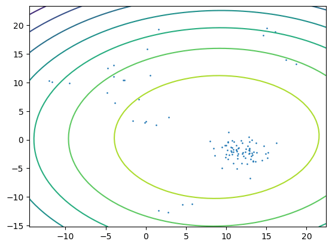

# Variational-Methods-for-the-Dirichlet-Process
Implementation for the paper "Variational Methods for the Dirichlet Process", Blei, D. M. and Jordan, M. I. (2004).

We have VI Based on Normal-Wishart Conjugate Prior version and Normal Conjugate Prior version.

